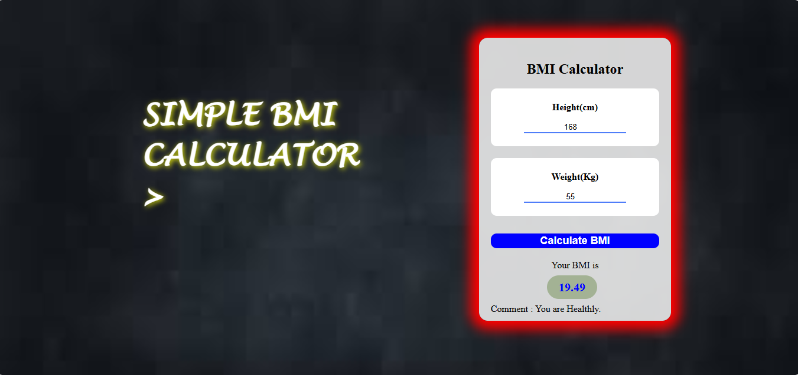

# 🧮 BMI Calculator Web App

A simple and interactive **BMI (Body Mass Index) Calculator** built using HTML, CSS, and JavaScript. This application allows users to input their height and weight to calculate BMI and get health category feedback.

---

## 🚀 Features

* Calculate BMI using height (cm) and weight (kg)
* Displays BMI result instantly
* Provides health category:

  * Underweight
  * Healthy
  * Overweight
  * Obese
* Clean and responsive UI design
* Input validation with alert message

---

## 🛠️ Technologies Used

* HTML5
* CSS3
* JavaScript (DOM Manipulation)

---

## 📂 Project Structure

```
BMI-Calculator/
│
├── index.html
├── img.jfif
└── README.md
```

---
## 📸 Preview



## ⚙️ How It Works

1. Enter height in centimeters
2. Enter weight in kilograms
3. Click on **"Calculate BMI"**
4. BMI value and health status will be displayed

---

## 🧠 Formula Used

```
BMI = (Weight in kg / Height in cm²) × 10000
```

---

## ❗ Validation

* Shows alert if height or weight is empty
* Ensures user enters valid input

---

## 💡 Future Improvements

* Add unit conversion (feet/inches, pounds)
* Improve mobile responsiveness
* Add chart/visual BMI indicator
* Store history of calculations

---

## 📌 Author

**Mayank Shringi**

---

## 🔗 Connect with Me

* GitHub: https://github.com/Mayank830205
* LinkedIn: https://www.linkedin.com/in/mayank-shringi/

---

## ⭐ If you like this project

Give it a ⭐ on GitHub and share your feedback!
